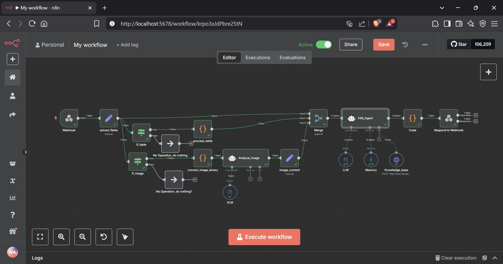

# 📘 README.md

&#x20;&#x20;

**FAQ_Chatbot** is a locally deployable, Retrieval-Augmented Generation (RAG) augmented chatbot. It leverages **n8n** orchestration, a **Chroma** vector store, and **Ollama** embeddings/LLMs to deliver accurate, ethically framed answers enriched by text, image, and table context. A built‑in Gradio UI and analytics dashboard provide a seamless user experience and real-time insights.


---

## 🚀 Key Features

- **RAG-Powered Retrieval**: Semantic search over locally hosted documents (PDF, TXT, MD)
- **Multi-Modal Inputs**: Text, Image (captioning/OCR), and Table (statistical summaries)
- **Local Hosting And Multi LLM Support**: Switch easily between Mistral, Llama3, Gemma, Falcon, Qwen via Ollama
- **Workflow Orchestration**: Visual pipelines in n8n with error handling & logging
- **Session Management**: MongoDB for conversation memory & response caching
- **Analytics Dashboard**: Query frequency, answer lengths, multimodal usage, fallback ratio

---

## 🏗️ Tech Stack

| Component              | Technology                    |
| ---------------------- | ----------------------------- |
| Embeddings & LLMs      | Ollama (`mxbai-embed-large`)  |
| Vector Store           | Chroma DB (local, persistent) |
| Workflow Orchestration | n8n                           |
| Frontend UI            | Gradio                        |
| API Framework          | FastAPI                       |
| Database               | MongoDB + Mongo Express       |
| Deployment             | Docker & Docker Compose       |

---

## 📂 Repository Structure

```
rag-chatbot-project/
├── workflows/
│   └── rag-chatbot-workflow.json    # n8n workflow definition
├── scripts/
│   ├── engineer-data.py                 # document preprocessing & splitting
│   ├── ingest_to_db.py                  # loader → chunk → embed → Chroma
│   ├── rag_query_server.py              # FastAPI wrapper for vector search
│   └── ui_server.py                     # Gradio UI + caching + analytics
├── data/
│   ├── raw-data/                        # original dataset CSVs
│   ├── sample-documents/                # generated PDF, TXT, MD files
│   └── chroma/                          # persistent vector DB files
├── docs/
│   ├── README.md                        # this file
│   └── technical-approach.md            # design & rationale
├── tests/
│   └── sample-queries.json              # test queries
│   └── images.jpg                       # test image
│   └── International-Space-Station.csv  # test csv
├── compose.yaml                         # Docker Compose configuration
├── .env                                 # environment variables
└── pyproject.toml                       # Python project config
```

---

## ⚙️ Getting Started

### Prerequisites

- **Docker** & **Docker Compose**
- **Python 3.10+**
- [**uv**](https://github.com/astral-sh/uv) package manager

### Installation

```bash
# Clone repository
git clone https://github.com/your-org/rag-chatbot-project.git
cd rag-chatbot-project

# Initialize Virtual Environment & install Python deps
uv venv
uv sync

# Launch Docker services
docker compose up -d
```

### Run Services

1. **RAG Query Server** (port 8000)

   ```bash
   uv run uvicorn scripts/rag_query_server:app --reload --port 8000
   ```

2. **UI & Analytics** (port 7860)

   ```bash
   uv run scripts/ui_server.py
   ```

3. **Access Interfaces**

   - **n8n Editor** → `http://localhost:5678`
   - **Gradio Chat UI** → `http://localhost:7860`
   - **Mongo Express** → `http://localhost:8081`

---

## 📖 Usage Example

```bash
# Submit a question via API
curl -X POST http://localhost:5678/webhook-test/ask-faq \
  -H "Content-Type: application/json" \
  -d '{"query": "What is Retrieval-Augmented Generation?"}'
```

Visit the Gradio UI to interact with images, tables, and view analytics in real time.

---

## 🤝 Contributing

1. Fork the repository
2. Create a feature branch (`git checkout -b feature/YourFeature`)
3. Commit your changes (`git commit -m 'Add feature'`)
4. Push to branch (`git push origin feature/YourFeature`)
5. Open a Pull Request

---

## 📜 License

This project is licensed under the **MIT License**.

---

---
