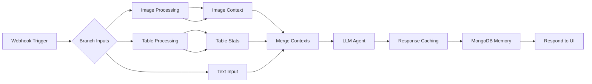

# 📄 technical-approach.md

## 1. Overview

The **rag-chatbot-project** combines cutting-edge RAG techniques with a fully local deployment. Our architecture ensures confidentiality, low latency, and modularity across data ingestion, retrieval, and generation layers.

---

## 2. Document Ingestion & Preparation

1. **Raw Source**: 20 articles from the Single-Topic RAG Evaluation Dataset (CSV format).
2. **Splitting**: `engineer-data.py` divides each document into three overlapping chunks (8 articles of , 2-article overlap).
3. **Formats**: Export each chunk as PDF, TXT, and MD (9 files total).
4. **Chunking & Embedding**: `ingest_to_db.py`:
   - Load supported formats with LangChain loaders
   - Chunk text via `RecursiveCharacterTextSplitter` (500–1000 tokens)
   - Generate embeddings using `OllamaEmbeddings(mxbai-embed-large)`
   - Persist to Chroma DB (`data/chroma`)

---

## 3. FastAPI Retrieval Service

- **Endpoint**: `/query` accepts JSON `{"query": string, "top_k": int}`
- **Process**:
  1. Embed query via Ollama
  2. Retrieve top\_k chunks with similarity scores
  3. Return JSON: `[{text, metadata, score}, ...]`

This wrapper enables n8n to treat vector search as a native HTTP tool.

---

## 4. n8n Workflow Architecture

1. **Trigger**: HTTP webhook ingesting `query`, `image`, `table`, `sessionId`.
2. **Context Branches**:
   - **Image**: Ollama VLM (Qwen2.5VL/Llava) for caption/OCR.
   - **Table**: Python code node summarizes numeric & categorical columns.
   - **Text**: Direct pass-through.
3. **Merge**: Consolidate `query`, `imageContext`, `tableStats`, `sessionId`.
4. **FAQ Agent**: Ollama chat with memory (MongoDB collection `n8n_chat_histories`) and RAG tool.
5. **Post-Processing**: Filter fallback responses; cache via MongoDB `response_caching`; log to `chat_logs`.
6. **Respond**: Webhook returns JSON answer & metadata.

---

## 5. Frontend & Analytics

Built with Gradio:

- **Chat Tab**: Query + optional attachments → displays responses.
- **Analytics Tab**:
  - **Session vs Global Frequency**
  - **Answer Length Distribution**
  - **Multimodal Input Ratio**
  - **Fallback Rate**
  - **Top Global Queries**

MongoDB aggregates drive real-time charts.

---

## 6. Challenges & Solutions

| Challenge                   | Solution                                                           |
| --------------------------- | ------------------------------------------------------------------ |
| Chroma integration in n8n   | FastAPI wrapper as HTTP tool                                       |
| Embedding latency           | Local Ollama model (`mxbai-embed-large`)                           |
| Handling multimodal inputs  | Custom code nodes + Ollama VLM                                     |
| Cache growth management     | Capped in-memory + MongoDB persistent eviction policy              |
| Model switching flexibility | Parameterized LLM node in n8n with environment-based configuration |

---

## 7. Future Work

- **UI Enhancements**: Custom CSS, responsive design
- **Streaming Responses**: WebSockets for partial outputs
- **Authentication**: JWT-based user sessions
- **Additional Vector Stores**: Support Weaviate, Pinecone
- **Extended Analytics**: Sentiment analysis, user retention metrics

---

*End of Documentation*

